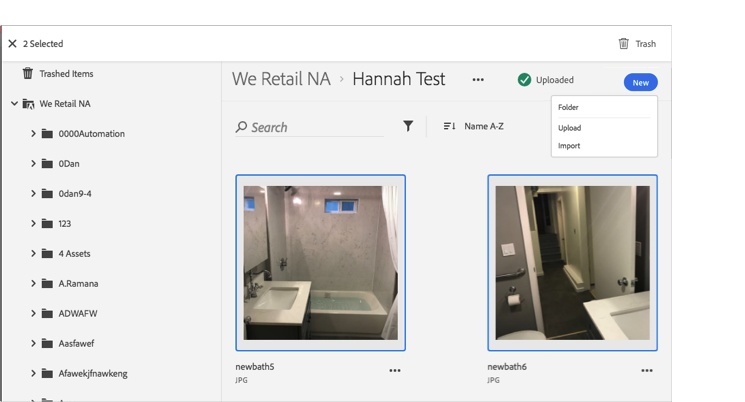

# 자산을 휴지통으로 이동{#trash-an-asset}

Adobe Experience Cloud 라이브러리에서 자산을 휴지통으로 이동하여 라이브러리에서 제거할 수 있습니다.

Experience Cloud 라이브러리에서 자산을 휴지통으로 이동하려면 다음을 수행하십시오.

1. 휴지통으로 이동할 하나 이상의 자산을 클릭합니다. 

1. 페이지 상단에 있는 **[!UICONTROL 휴지통]** 아이콘을 클릭합니다.

