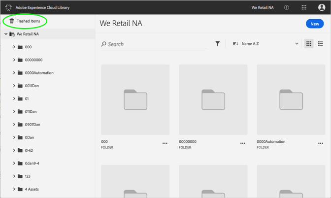
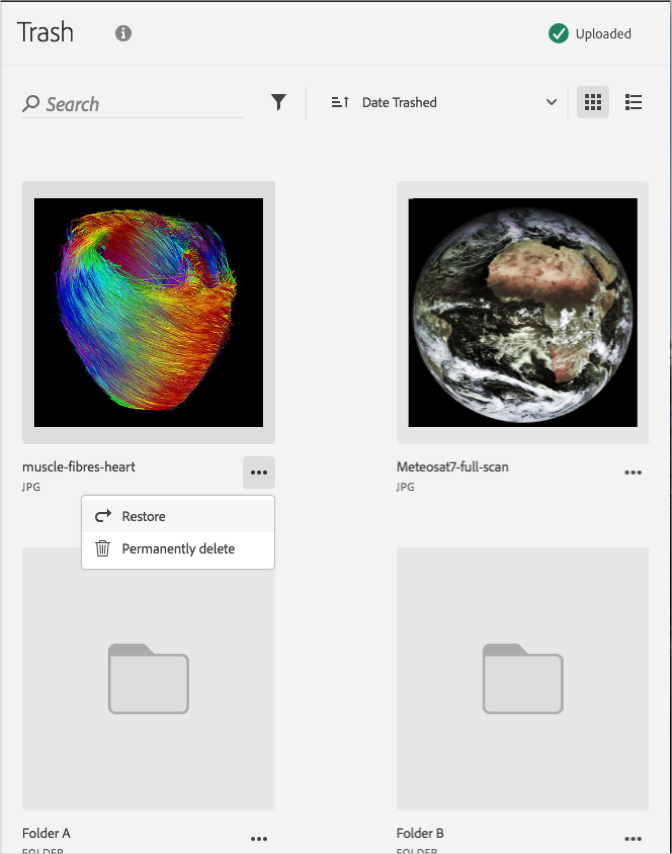

# 휴지통으로 이동된 자산 복원{#restore-a-trashed-asset}

Adobe Experience Cloud 라이브러리에서 휴지통으로 이동된 자산을 복원할 수 있습니다.

항목을 휴지통으로 이동하면 60일 간 Experience Cloud 라이브러리의 휴지통으로 이동된 항목 영역에 있습니다. 항목을 복원하지 않으면 60일 후에 Experience Cloud 라이브러리가 이를 영구적으로 삭제합니다.

60일 이내에 휴지통으로 이동된 자산을 복원합니다.

1. **[!UICONTROL 휴지통으로 이동된 항목]**&#x200B;을 클릭합니다.

   

1. 복원할 항목을 하나 이상 클릭합니다.
1. **[!UICONTROL 추가 정보 &gt; 복원]**&#x200B;을 클릭합니다.

   

1. 선택한 자산을 복원할지 확인합니다.

복원된 자산 확인이 맨 위에 표시됩니다.
