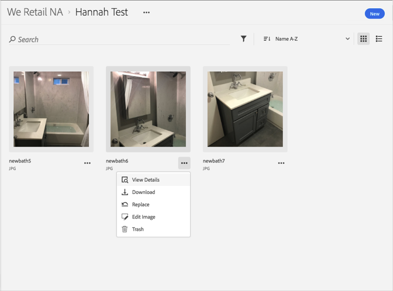
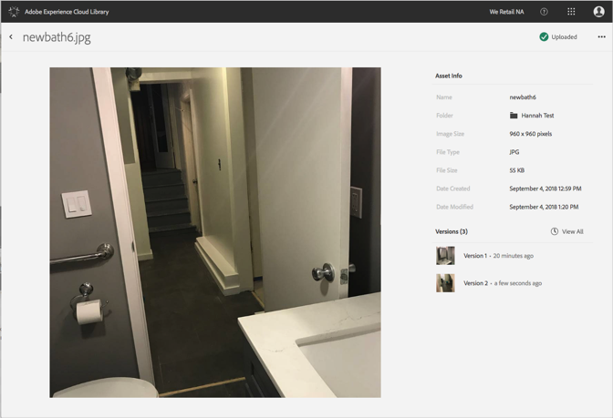

# 이전 버전의 자산으로 되돌리기{#revert-to-an-older-version-of-an-asset}

Adobe Experience Cloud 라이브러리에서 이전 버전의 자산으로 되돌릴 수 있습니다.

Experience Cloud 라이브러리에서 이전 버전의 자산으로 되돌리려면 다음을 수행하십시오.

1. 자산을 클릭합니다.
1. 자산 옆에 있는 **[!UICONTROL 추가 옵션]** 메뉴(줄임표)를 클릭합니다.

   

1. **[!UICONTROL 자산 세부 사항]**&#x200B;을 클릭합니다.
1. 버전 옆의 **[!UICONTROL 모두 보기]**&#x200B;를 클릭하여 자산의 모든 버전을 확인합니다.

   

1. 버전 목록에서 되돌릴 버전 옆의 **[!UICONTROL 추가 옵션]** 메뉴(줄임표)를 클릭합니다.

   

1. **[!UICONTROL 되돌리기]**&#x200B;를 클릭합니다.

이제 되돌아온 버전이 현재 버전이 됩니다.
