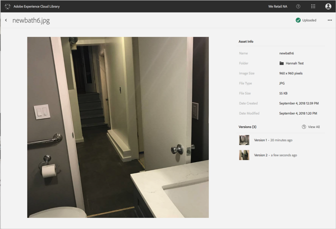

# 자산의 이전 버전 보기{#view-previous-versions-of-an-asset}

Adobe Experience Cloud 라이브러리에서 이전 버전의 에셋을 볼 수 있습니다.

Experience Cloud 라이브러리에서 자산의 이전 버전을 보려면 다음을 수행하십시오.

1. 자산을 선택합니다.
1. 자산 옆에 **[!UICONTROL 있는 추가 옵션]** 메뉴 (줄임표) 를 선택합니다.

   

1. **[!UICONTROL 자산 세부 사항을]**&#x200B;선택합니다.
1. 버전 옆의 **[!UICONTROL 모두 보기를]** 선택하여 자산의 모든 버전을 확인합니다.

   

