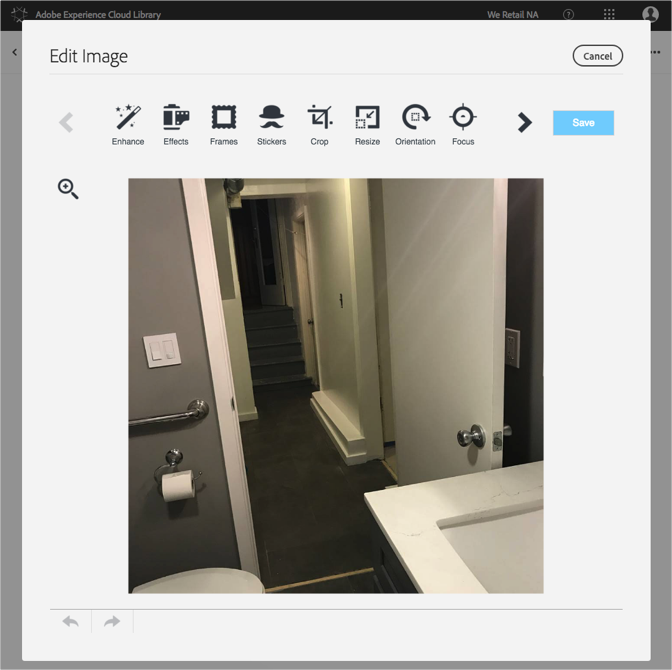

# 이미지 편집{#edit-an-image}

Adobe Experience Cloud 라이브러리에 내장된 기본 이미지 편집기를 사용하여 라이브러리에서 바로 이미지를 편집할 수 있습니다.

Experience Cloud 라이브러리에서 이미지를 편집하려면 다음을 수행하십시오.

1. 편집할 이미지를 클릭합니다.
1. 이미지 편집을 클릭합니다. 이미지를 저장하면 새 버전으로 저장됩니다.

   이미지 편집기가 열리고 이미지를 편집할 수 있습니다.

   

