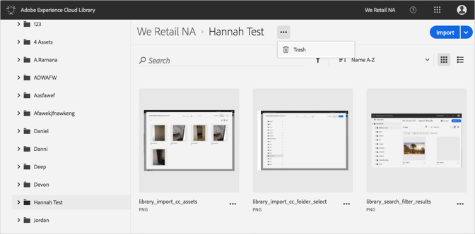
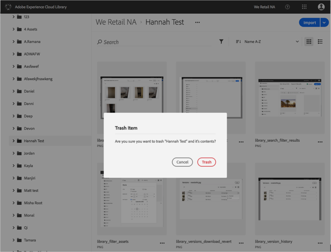

# 폴더를 휴지통으로 이동{#trash-a-folder}

Adobe Experience Cloud 라이브러리에서 폴더를 삭제할 수 있습니다.

Experience Cloud 라이브러리의 폴더를 삭제하려면 다음을 수행하십시오.

1. 폴더를 삭제로 클릭합니다.
1. **[!UICONTROL 추가 옵션 메뉴]**(줄임표)를 클릭하고 **[!UICONTROL 삭제]**&#x200B;를 선택합니다.

   

1. 폴더를 삭제할지 확인합니다.

   

