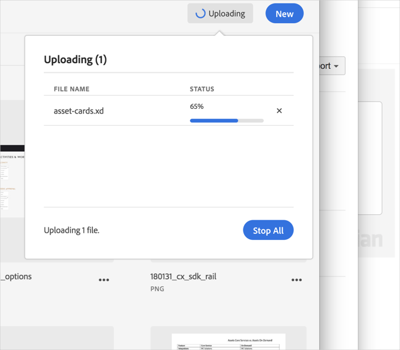

# 업로드 취소{#cancel-an-upload}

파일을 잘못되었거나 너무 큰 파일을 선택하면 장치에서 Adobe Experience Cloud 라이브러리로 업로드를 취소합니다.

이미 시작한 업로드를 취소하려면:

1. 알림 표시기를 클릭합니다.
1. 모든 다운로드를 중단하려면 **[!UICONTROL [모두]** 중지] 를 클릭하고 취소하려면 개별 파일 옆의 **[!UICONTROL X]** 를 클릭합니다.

   

동일한 이름의 파일을 하나 이상 선택하면 Experience Cloud 라이브러리에서 이전 버전을 대체하거나 새 버전을 유지하라는 메시지가 표시됩니다.
