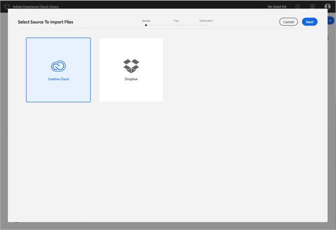
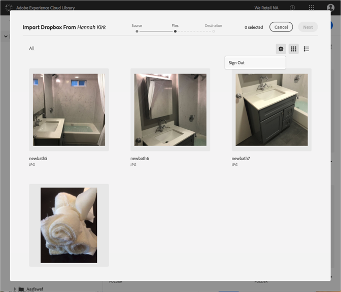

# Dropbox 또는 Creative Cloud 계정 변경{#change-dropbox-or-creative-cloud-accounts}

다른 Dropbox 또는 Creative Cloud 계정으로 전환하여 Adobe Experience Cloud 라이브러리에 콘텐츠를 추가합니다.

Dropbox 또는 Creative Cloud 계정에 로그인하면 로그아웃하거나 계정을 전환할 때까지 로그인 상태가 유지됩니다.

다른 Dropbox 또는 Creative Cloud 계정으로 전환하려면 다음을 수행하십시오.

1. 선택 **[!UICONTROL 신규]** > **[!UICONTROL 가져오기]**.

   

1. **[!UICONTROL Creative Cloud]** 또는 **[!UICONTROL Dropbox]**&#x200B;를 선택합니다.

   

1. **[!UICONTROL 다음]**&#x200B;을 선택합니다.
1. 오른쪽 상단 모서리에서 톱니바퀴 아이콘을 선택합니다.

   

1. **[!UICONTROL 로그아웃]**&#x200B;을 선택합니다.
1. 다른 계정에 로그인합니다.

