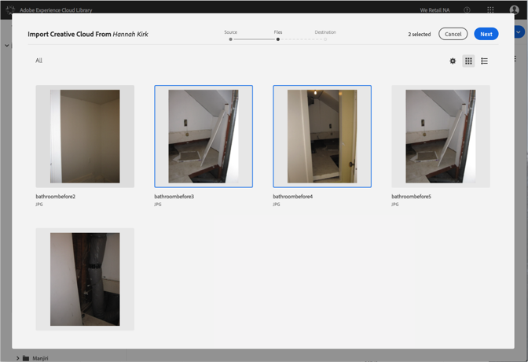
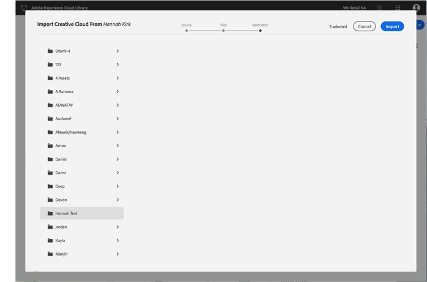

# Adobe Experience Cloud 라이브러리로 Creative Cloud 파일 가져오기{#import-creative-cloud-files-into-the-adobe-experience-cloud-library}

Creative Cloud의 파일을 Adobe Experience Cloud 라이브러리로 가져와 모든 Adobe Experience Cloud 제품에서 관리할 수 있습니다.

>[!NOTE]
>
>이 작업을 수행하려면 먼저 폴더를 만들어야 합니다.

Creative Cloud 파일을 Experience Cloud 라이브러리로 가져오려면 다음을 수행하십시오.

1. **[!UICONTROL 새로 만들기]** &gt; **[!UICONTROL 가져오기를]**&#x200B;선택합니다.

   

1. Creative **[!UICONTROL Cloud]**&#x200B;를 선택합니다.

   아직 없는 경우 Creative Cloud 계정에 로그인합니다.

   

1. Click **[!UICONTROL Next]**.
1. 가져올 파일을 하나 이상 선택합니다.

   

1. Click **[!UICONTROL Next]**.
1. 자산을 배치할 폴더를 선택합니다.

   >[!NOTE]
   >
   >자산을 가져올 폴더 하나를 선택할 수 있습니다. 여러 폴더에 파일을 가져오려면 각 폴더에 대해 이 작업을 반복합니다.

   

1. ****&#x200B;가져오기를 클릭합니다.

