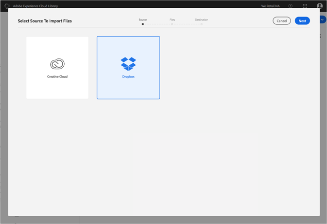
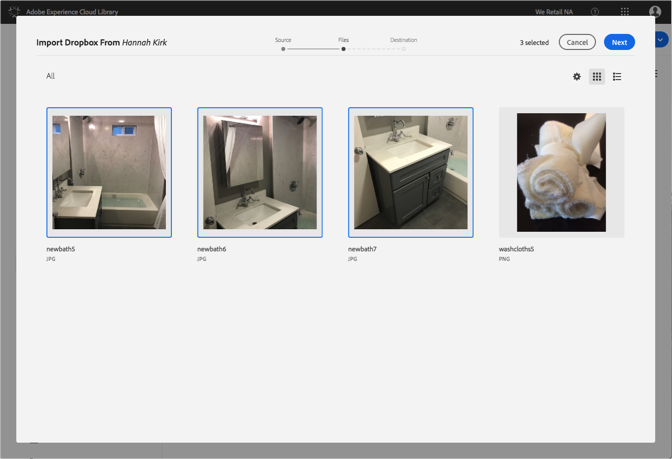
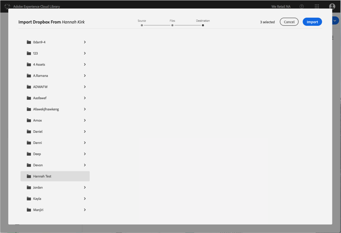

# Dropbox 파일을 Adobe Experience Cloud 라이브러리로 가져오기{#import-dropbox-files-into-the-adobe-experience-cloud-library}

Dropbox에서 Adobe Experience Cloud 라이브러리로 파일을 가져와 모든 Adobe Experience Cloud 제품에서 관리할 수 있습니다.

>[!NOTE]
>
>이 작업을 수행하려면 먼저 폴더를 만들어야 합니다.

Dropbox 파일을 Experience Cloud 라이브러리로 가져오려면 다음을 수행하십시오.

1. Select **[!UICONTROL New]** > **[!UICONTROL Import]**.

   

1. **[!UICONTROL Dropbox]**&#x200B;를 선택합니다.

   아직 로그인하지 않은 경우 Dropbox 계정에 로그인합니다.

   

1. **[!UICONTROL 다음]**&#x200B;을 클릭합니다.
1. 가져올 파일을 하나 이상 선택합니다.

   

1. **[!UICONTROL 다음]**&#x200B;을 클릭합니다.
1. 자산을 배치할 폴더를 선택합니다.

   >[!NOTE]
   >
   >자산을 가져올 폴더 하나를 선택할 수 있습니다. 여러 폴더에 파일을 가져오려면 각 폴더에 대해 이 작업을 반복합니다.

   

1. **[!UICONTROL 가져오기]**&#x200B;를 클릭합니다.

