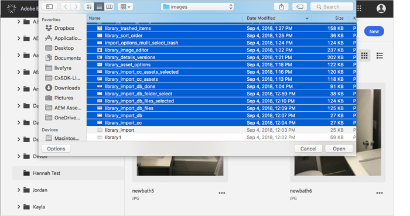
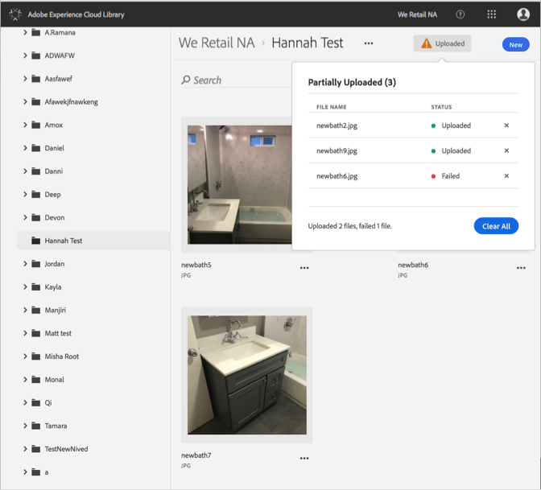

# 장치에서 자산 업로드{#upload-asset-from-device}

장치에서 자산을 업로드하여 Adobe Experience Cloud 라이브러리에서 관리합니다.

장치에서 Experience Cloud 라이브러리에 자산을 업로드하려면 다음을 수행하십시오.

1. Select **[!UICONTROL New]** > **[!UICONTROL Upload]**.

   

1. Experience Cloud 라이브러리에 업로드할 자산을 선택합니다.

   

1. 파일이 업로드되면 알림 상자에 확인 또는 오류 메시지가 표시됩니다.

   

